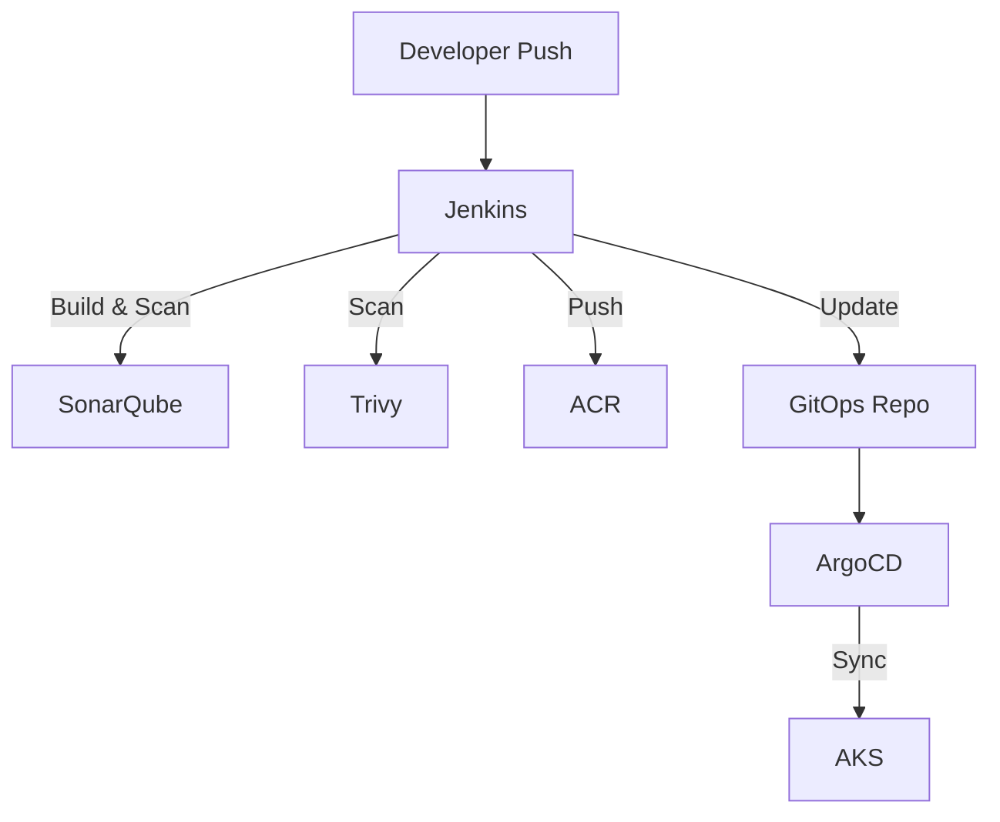

# 🛒🛡️ DevSecOps E-commerce App - Microservices Architecture

A complete DevSecOps pipeline and microservices-based e-commerce web application. This project demonstrates modern CI/CD, GitOps, and DevSecOps practices using Jenkins, ArgoCD, Kubernetes, Terraform, SonarQube, and more — deployed to Azure Kubernetes Service (AKS).

---

## 🧱 Architecture Overview

- **Frontend**: React.js
- **Backend Services**:
  - `auth-service` – user login, JWT
  - `product-service` – catalog handling
  - `order-service` – order processing
- **CI/CD**: Jenkins
- **GitOps**: ArgoCD
- **Infrastructure**: Terraform + Helm on Azure
- **Security**: SonarQube (SAST), Checkov (IaC scan)
- **Monitoring**: Prometheus + Grafana
- **Container Registry**: Azure Container Registry (ACR)

---

## 🚀 CI/CD Pipeline Overview


1. Developer pushes code to the `mini-e-commerce` repository
2. Jenkins is triggered via webhook
3. Code is analyzed by **SonarQube**
4. Jenkins builds Docker images → pushes to **ACR**
5. Jenkins updates image tags in this **GitOps** repository
6. ArgoCD detects changes → syncs to **AKS**
7. App is auto-deployed or updated via Kubernetes manifests

---

## 📁 Folder Structure – `DevSecOps` Repo

```
devsecops/
├── argocd/
│ ├── app/
│ │ ├── auth-service.yaml
│ │ ├── frontend.yaml
│ │ ├── order-service.yaml
│ │ └── product-service.yaml
│ └── frontend/
│   ├── auth-service/
│   ├── frontend/
│   ├── order-service/
│   └── product-service/
├── checkov/checkov_scan.sh
└── terraform/
  ├── envs/
  │ ├── production/
  │ └── staging/
  └── modules/
    ├── acr/
    ├── aks/
    ├── argocd/
    ├── jenkins/
    ├── monitoring/
    ├── network/
    ├── nginx_ingress/
    └── resource_group/
```

---

## 📦 App Source Code – `mini-e-commerce` Repo

This repository contains the source code of the e-commerce system, structured as independent services.

```
mini-e-commerce/
├── auth-service/
│   ├── Dockerfile
│   └── src/
├── product-service/
│   ├── Dockerfile
│   └── src/
├── order-service/
│   ├── Dockerfile
│   └── src/
└── frontend/
    ├── Dockerfile
    └── src/
```

### Microservices Details

| Service           | Description                            | Tech Stack              |
|-------------------|----------------------------------------|-------------------------|
| `frontend`        | React-based web app                    | React.js, Axios         |
| `auth-service`    | JWT-based login and registration       | Node.js, Express, MongoDB |
| `product-service` | Product catalog API                    | Node.js, Express, MongoDB |
| `order-service`   | Order and payment processing           | Node.js, Express, MongoDB |

---

## 🔐 DevSecOps Features

### ✅ Static Code Analysis

- **Tool**: SonarQube
- Enforced Quality Gates: bugs, vulnerabilities, smells


### 🛡️ Infrastructure as Code Scanning

- **Tool**: Checkov
- Scans Terraform IaC for:
  - Misconfigurations
  - Insecure defaults
  - Policy violations

```bash
# Run Checkov scan
bash checkov/checkov_scan.sh
```

---

## 🔁 GitOps with ArgoCD

Application deployment is fully automated via **ArgoCD**. It syncs Kubernetes manifests from this repository to the AKS cluster.

- `argocd/app/*.yaml`: ArgoCD App CRs
- `argocd/base/...`: Service-specific Helm or YAML

Update process:

```text
Jenkins builds image → updates GitOps manifest in this repo →
Push to main branch → ArgoCD auto-syncs →
Kubernetes rollout triggered
```


---

## 📈 Monitoring & Logging

| Tool         | Purpose                                |
|--------------|----------------------------------------|
| Prometheus   | Metrics scraping from pods             |
| Grafana      | Visualization of service performance   |
| Loki (opt)   | Logging (can be added)                 |
| Alertmanager | Alert rules (e.g., Slack/Email)        |

  
---

## 🧪 Local Dev & Docker

Each service can run independently for local testing:

```bash
# Build
docker build -t auth-service ./auth-service

# Run
docker run -d -p 5001:5001 auth-service
```

> Recommend using `docker-compose` for orchestration: docker-compose up -d

---

## 📌 Prerequisites

Ensure the following are available in your local/CI:

- [ ] Docker
- [ ] Terraform ≥ 1.3
- [ ] Kubectl
- [ ] Azure CLI (`az`)
- [ ] Helm
- [ ] Checkov
- [ ] Jenkins (or GitHub Actions)
- [ ] SonarQube server

---

## 📄 Deployment Flow



---

## 📚 Related

- `mini-e-commerce`: [GitHub Repo Link](https://github.com/your-org/mini-ecommerce)
- `DevSecOps`: [GitHub Repo Link](https://github.com/your-org/devsecops)
- ArgoCD Dashboard:

- Jenkins Dashboard: 

- Grafana: 

---

## 🧑‍💻 Authors & Credits

- DevOps Engineer: Luu Quoc Cuong
- mini-e-commerce-app Dev: 


